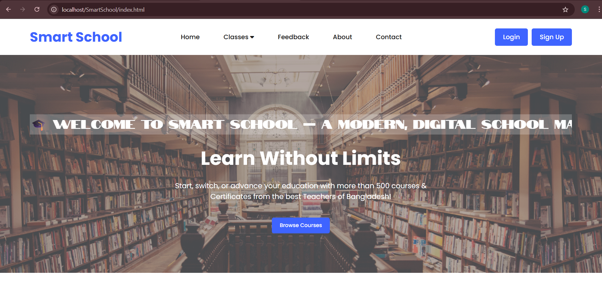
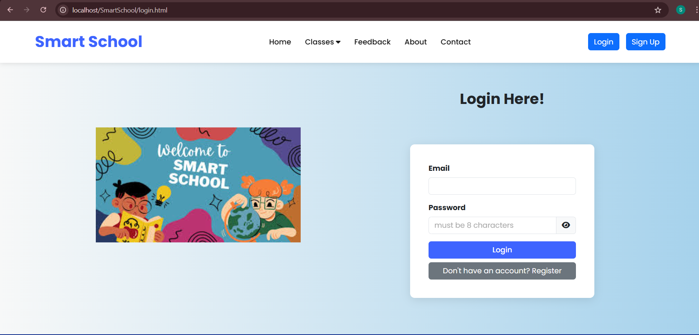
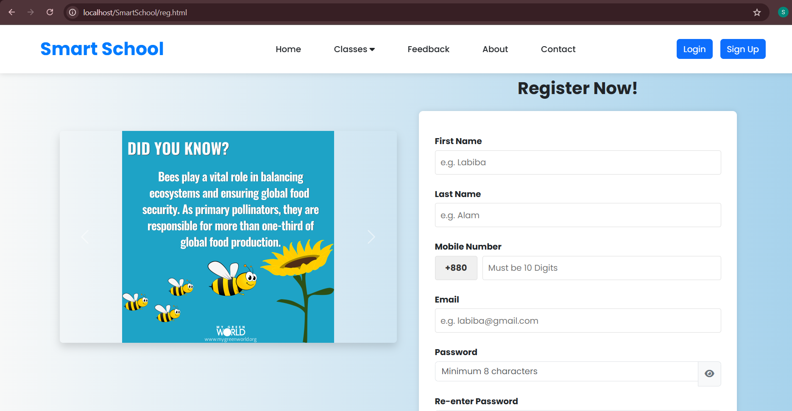

🎓 A responsive educational web platform for Bangladeshi students (Class 6–10), featuring NCTB books, topic-wise videos, online exams, and result viewing. Built using HTML, CSS, JavaScript, Bootstrap, and PHP with XAMPP.
## 🚀 How to Run the Project

1. **Start XAMPP**  
   - Open XAMPP and start **Apache** and **MySQL**, press "admin" beside MySQL.

2. **Set up the Database**   
   - Run the following queries to create a database and necessary tables in **phpMyAdmin** (or MySQL):
   - CREATE DATABASE hey;
USE hey;

-- User Registration/Login Table
CREATE TABLE users (
    id INT AUTO_INCREMENT PRIMARY KEY,
    first_name VARCHAR(50) NOT NULL,
    last_name VARCHAR(50) NOT NULL,
    mobile VARCHAR(20) NOT NULL,
    email VARCHAR(100) NOT NULL UNIQUE,
    password VARCHAR(255) NOT NULL,
    address VARCHAR(255),
    created_at TIMESTAMP DEFAULT CURRENT_TIMESTAMP
);  

-- Feedback Table
CREATE TABLE feedback (
    id INT AUTO_INCREMENT PRIMARY KEY,
    rating INT NOT NULL,
    comment TEXT,
    submitted_at TIMESTAMP DEFAULT CURRENT_TIMESTAMP
);  

-- Quiz Results Table
CREATE TABLE quiz_results (
    id INT AUTO_INCREMENT PRIMARY KEY,
    user_id INT NOT NULL,
    quiz_title VARCHAR(100) NOT NULL,
    score INT NOT NULL,
    total_questions INT NOT NULL,
    percentage DECIMAL(5,2) NOT NULL,
    submitted_at DATETIME DEFAULT CURRENT_TIMESTAMP,
    FOREIGN KEY (user_id) REFERENCES users(id) ON DELETE CASCADE
);  

-- Contact Messages Table
CREATE TABLE contact_messages (
  id INT AUTO_INCREMENT PRIMARY KEY,
  name VARCHAR(100) NOT NULL,
  email VARCHAR(100) NOT NULL,
  subject VARCHAR(255) NOT NULL,
  message TEXT NOT NULL,
  submitted_at TIMESTAMP DEFAULT CURRENT_TIMESTAMP
);

3. Run the Project:
Place the project folder inside the htdocs directory of XAMPP.
In your browser, go to: http://localhost/SmartSchool/index.html  and it will redirect you to the website. For now, in classes dropdown, only class 6-->Science works with textbook, video lectures, quiz and notes
features. HTML files of all pages are also attached so that they can be visited particularly too.

🎯 Features:
-Browse books, videos, and resources easily (free access without login).  
-User registration & login system (with secure password hashing).  
-Store and view exam results online.  
-Save contact and feedback info in the database.  
-Fully responsive design with smooth scrolling.  

🔒 Security:
Passwords are hashed before being stored in the database, ensuring even the site owner cannot view them.

## 📸 Screenshots of some pages
### Homepage

### Login Page

### Sign Up/ Registration Page

 
